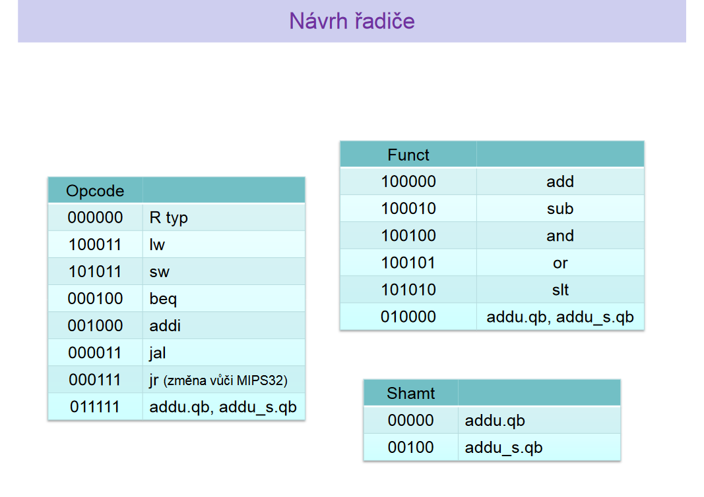
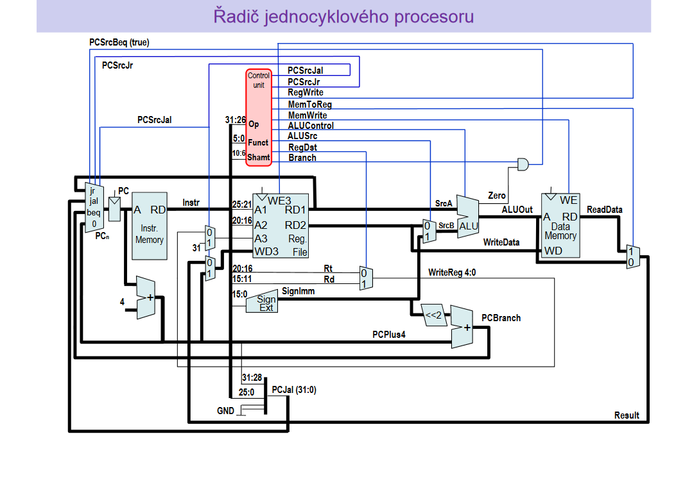
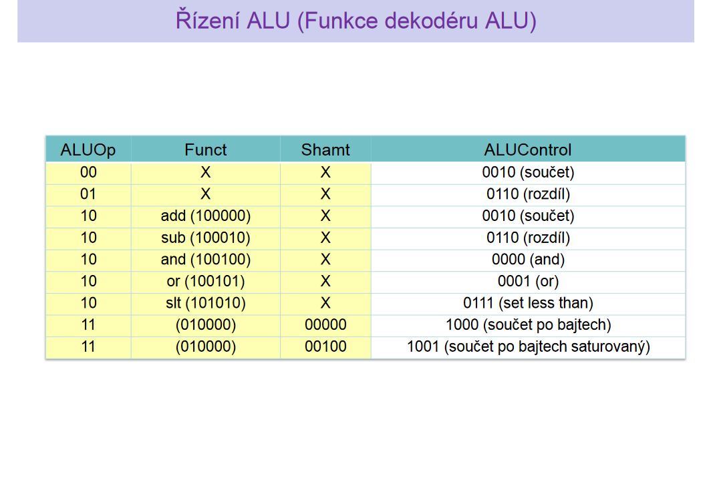
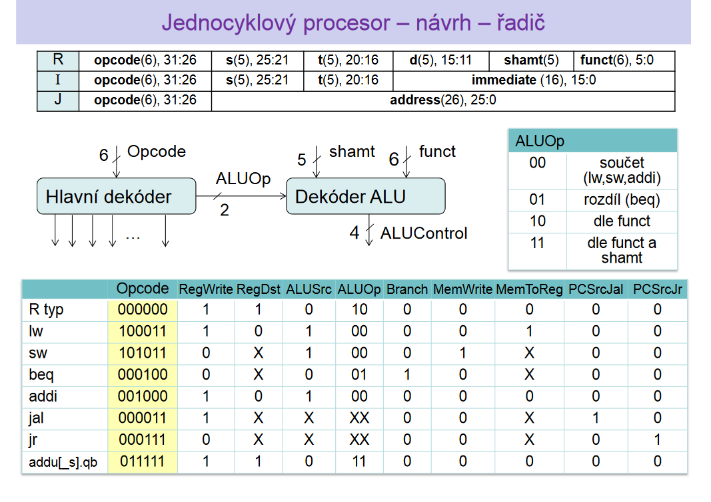

# Simple-MIPS32-processor
This is a school project where I implemented in Verilog simple single cycle CPU based on MIPS32 architecture. We also create a simple program for finding maximum in an array that can be executed on the processor.

# Processor design figures

